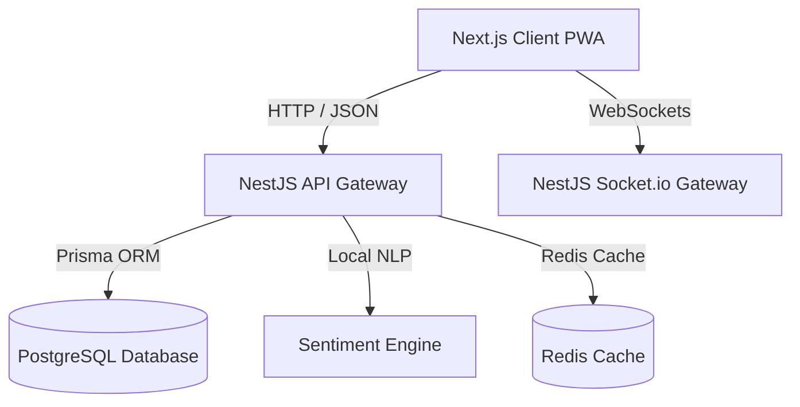

# Campus Echo — Architectural Specifications

Campus Echo is built as a high-density, secure student-administration communication ecosystem. The application utilizes a **monorepo workspace** separating client and server concerns.

## Technical Architecture

## Database Schema (Prisma Models)

The database schema is defined in `backend/prisma/schema.prisma`. Relationships are fully indexed to support venture-scale read operations.

### Core Entity Definitions

*   **User**: Primary identity container. Links to encrypted authentication credentials (password hashes, optional MFA secrets). Contains a direct foreign key relation to a single `Role` container.
*   **Role & Permission**: Granular Role-Based Access Control (RBAC). Roles map to unique arrays of system permissions (e.g., `post:create`, `ticket:resolve`).
*   **Profile**: Real verified credentials (university, department, batch, class, first name, last name). Contains the **Echo Score** reputation index.
*   **AnonymousProfile**: Decoupled alias container. Restricts public visibility by only linking alias names and random avatar URLs to posts or comment payloads.
*   **Post**: Discussion thread element. Supports normal feeds, official announcements, and polls.
*   **Poll & PollOption**: Nested voting structure with option limits and expiration timestamps.
*   **Comment**: Collapsible nested threads using recursive parent self-references.
*   **Ticket**: System-assigned administrative issue ticket (workflows: `SUBMITTED`, `REVIEW`, `ASSIGNED`, `IN_PROGRESS`, `RESOLVED`, `CLOSED`).
*   **Report**: Moderation review container for posts or comments.
*   **Club & Event**: Student association hubs. Supports event scheduling, RSVP list tallies, and ticketing.
*   **MarketplaceItem**: Used for peer-to-peer student marketplace.
